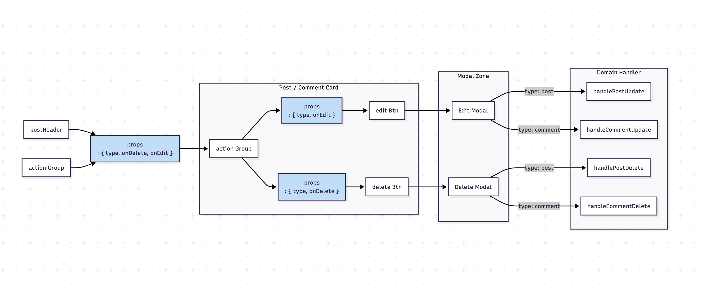

#  ActionGroup 재사용 컴포넌트 설계

`actionGroup` 컴포넌트는 게시글, 댓글 등 다양한 도메인에서
**수정(Edit) / 삭제(Delete)** 두 가지 행동을 공통적으로 제공해야 했기 때문에
재사용성을 최우선으로 고려하여 설계했다.

각 행동에 연결된 모달(EditModal / DeleteModal)까지 포함한 “도메인 행동 패키지”로 작동한다.

---

# 요구사항 정리

* 게시글/댓글 등 여러 도메인에서 동일한 Action UI 필요
* 수정/삭제의 로직(fetch, navigation 등)은 각 도메인마다 다름
* 모달(확인창)은 일관된 형태를 유지해야 함
* ActionGroup은 UI+로직을 아우르되, 도메인 규칙에는 의존하지 않아야 함

---

# 해결 전략 
## type + handler 구조화

ActionGroup이 도메인에 따라 다르게 동작해야 하므로
상위 계층에서 아래 두 가지를 전달하도록 구성했다.

1. **type** → 어떤 도메인인지 명시 (게시글 / 댓글)
2. **handler** → 수정/삭제 시 수행할 실제 비즈니스 로직

공통 enum을 두어 도메인 텍스트를 안정적으로 관리했다.

```js
export const ContentType = Object.freeze({
  POST: "게시글",
  COMMENT: "댓글",
});
```

---

# EditModal / DeleteModal 구조

두 모달은 공통 Modal 컴포넌트를 기반으로 하며
타이틀/서브타이틀/onClick만 다르기 때문에 최소한의 차이만 둔다.

### EditModal

```js
function EditModal(action) {
  const modal = Modal({
    title: `${action.type}을 수정하시겠습니까?`,
    subTitle: "",
    onClick: action.onEdit,
  });

  document.body.appendChild(modal);
  return modal;
}
```

### DeleteModal

```js
function DeleteModal(action) {
  const modal = Modal({
    title: `${action.type}을 삭제하시겠습니까?`,
    subTitle: "삭제한 내용은 복구할 수 없습니다.",
    onClick: action.onDelete,
  });

  document.body.appendChild(modal);
  return modal;
}
```

→ 이 방식 덕분에 Delete/Edit에 대한 UI 표준을 유지하면서도
도메인별 로직(onEdit, onDelete)은 외부에서 자유롭게 주입할 수 있다.

---

# ActionGroup에서 연결

ActionGroup은 상위로부터 받은 type, onDelete, onEdit을 그대로 모달에 넘긴다.

```js
const actionBtnGroup = actionGroup({
  type: ContentType.COMMENT,
  onDelete: () => handleCommentDelete({ postId, props }),
  onEdit: () => handleCommentNav({ postId, props }),
});
```

→ ActionGroup 자체는 “도메인에 대한 지식이 없음”
→ 삭제/수정 로직은 전적으로 외부에서 주입


---

# 구조 요약

아래 구조가 전체 설계의 핵심 흐름이다:

```
[actionGroup]
   ├─ Edit 버튼 → EditModal → onEdit(handler)
   └─ Delete 버튼 → DeleteModal → onDelete(handler)
```

* ActionGroup: UI + 모달 연결 담당
* Modal들: 공통 UI 컴포넌트
* 실제 삭제/수정 작업: handler로 외부 주입
* ContentType enum: 화면 텍스트의 일관성 유지



# 느낀 점

* 도메인 로직을 actionGroup에 넣지 않고 외부 handler로 분리한 덕분에
  **확장성 높은 재사용 컴포넌트**로 완성됨.
* 모달 UI는 동일하면서도 내부 로직은 주입받는 방식이 가장 안정적이었다.
* ContentType enum을 통해 텍스트도 표준화되어 유지보수 부담이 줄어듦.
* 전체 구조가 React의 props 기반 설계와 유사하여 이해하기도 쉬웠다.
