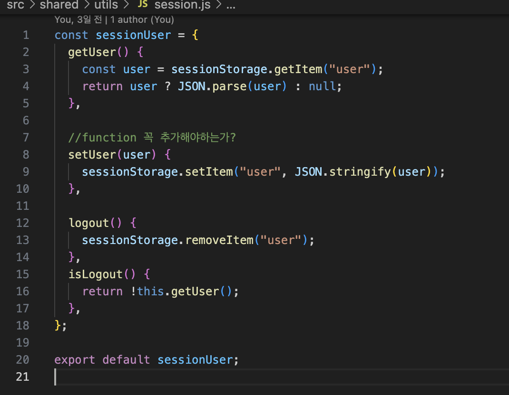
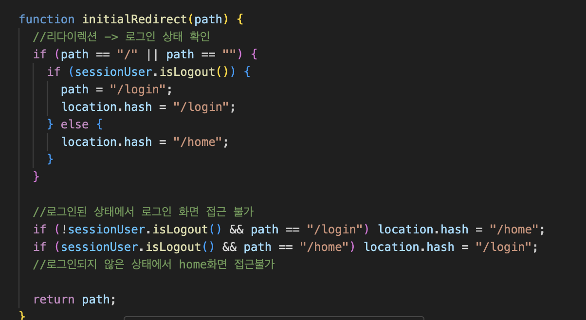

# 로그인 상태 관리와 라우팅 충돌 문제

SPA로 구현하면서 로그인 정보는 `sessionStorage`에 저장하고,
**세션 값이 없으면 로그아웃 상태**로 처리하는 방식으로 개발을 시작했다.

처음에는 각 페이지 컴포넌트 내부에서 다음 로직을 직접 구현했다.

* 로그인 상태(login)일 때 → **로그인 페이지에 접근 불가**
* 로그아웃 상태(logout)일 때 → **home 등 보호 페이지에 접근 불가**

즉, 페이지마다 직접 조건으로 접근 권한을 제어하는 방식이었다.

---

## 문제 1 — 페이지마다 로그인 여부를 검사 → 코드 중복 증가

홈 페이지, 마이페이지, 게시판 상세 등 **여러 페이지에서 동일한 조건문**이 반복되었고
조건이 조금씩 달라져 점점 유지보수가 어려워졌다.

---

## 문제 2 — 로그인/비로그인 페이지가 섞이면서 충돌 발생

프로젝트에는 권한이 서로 다른 페이지가 섞여 있었다.

| 페이지 유형            | 예시                 | 접근 조건          |
| ----------------- | ------------------ | -------------- |
| 로그인 시 접근 불가 페이지   | 로그인 / 회원가입         | 로그인하면 들어가면 안 됨 |
| 로그인해야만 접근 가능한 페이지 | 홈 / 게시글 목록 / 마이페이지 | 로그인이 아니면 접근 불가 |

### 문제 사례

로그아웃 상태라서 로그인 페이지로 리다이렉트하도록 했는데
→ **회원가입 페이지까지 접근이 막혀버림**

즉, “로그아웃 상태에서 예외적으로 열려 있어야 하는 페이지”와 “절대 접근하면 안 되는 페이지”를 구분하기 어려웠다.

페이지마다 조건문을 넣을 때 이런 케이스를 일일이 처리해야 해서 구조가 점점 무거워졌다.

---

## 문제 3 — 권한 로직이 모든 페이지에 퍼져있어 수정 비용 증가

로그인 체크 방식이 바뀌거나, 새로운 페이지가 추가될 때마다
**여러 파일을 동시에 수정해야 하는 구조**가 되었고,

SPA 전체 흐름이 권한 조건에 끌려다니는 형태가 되었다.

---

# 결론 및 추후 개선 방향

현재 구조는 아래 이유로 유지보수성이 낮다.

* 권한 조건이 여러 페이지에 흩어져 있고
* 예외 페이지(로그인/회원가입 등) 처리가 번거롭고
* 보호 페이지/비보호 페이지를 체계적으로 구분하기 어려움

따라서 앞으로는 **라우터 레벨에서 인증 권한을 통합 관리하는 구조로 개선할 예정**이다.

* `publicRoutes` / `privateRoutes` 배열로 분리
* 라우터에서 한 번만 로그인 여부를 판단해 접근 허용/차단
* 페이지 내부에서는 “렌더링 역할”만 수행하도록 책임 분리

