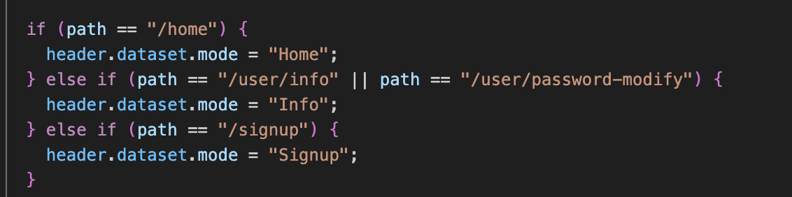
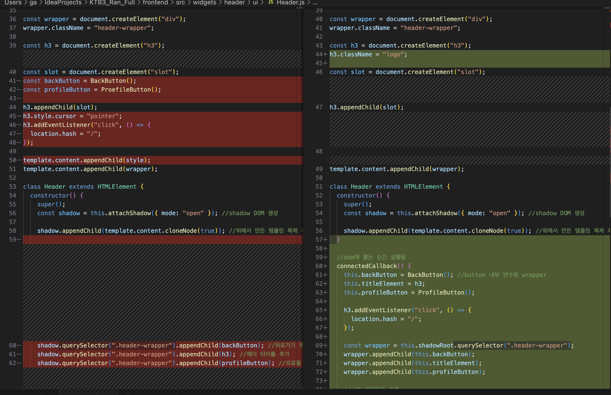

# SPA Header 상태 제어와 Web Component 도입

### 요구사항 정리

* 로그인/로그아웃 페이지에서는 프로필 버튼이 보이면 안 됨.
* 로그아웃 페이지에서는 **뒤로가기 버튼이 반드시 있어야 함**.
* 회원 정보 페이지에서는 **뒤로가기 버튼이 보이면 안 됨**.

SPA(hash 기반)로 구현하다 보니 `location.hash`는
브라우저 히스토리 스택처럼 동작하지 않아
“현재 페이지가 스택의 top인지”를 판단하기 어려웠다.

이 때문에 특정 페이지에서 뒤로가기 버튼을 숨기거나 노출하는 작업이 반복적으로 어려웠고,
각 페이지마다 개별적으로 UI 제어 로직을 넣다 보니 유지보수성이 급격히 떨어졌다.

---

# 해결 전략 
## data-mode 기반 UI 제어

개별 페이지에서 조건문을 넣는 대신,
**Header 전체가 UI 제어의 단일 책임(Single Responsibility)을 가지도록 변경**했다.

### 접근 방식

* 각 페이지는 필요한 UI 모드를 data attribute(`data-mode`)로만 알려줌
* Header Web Component는 이 attribute를 감지하여 UI를 자동 업데이트


---

# Web Component 도입이 도움이 되었던 부분

### Shadow DOM 기반의 독립성

전역 스타일의 영향을 받지 않기 때문에
header 내부 스타일/구조를 안정적으로 유지할 수 있었다.

### React의 컴포넌트와 유사한 구조

* 생명주기(connectedCallback)
* 속성 관찰(observedAttributes)
  이 두 가지가 특히 유용했다.

---

## 1) connectedCallback 활용

Header가 DOM에 attach될 때 필요한 요소들을 초기화했다.

```js
connectedCallback() {
  this.backButton = BackButton();
  this.titleElement = h3;
  this.profileButton = ProfileButton();

  const wrapper = this.shadowRoot.querySelector(".header-wrapper");
  wrapper.appendChild(this.backButton);
  wrapper.appendChild(this.titleElement);
  wrapper.appendChild(this.profileButton);

  this._updateUI();
}
```

이전에는 렌더링 흐름이 흐릿했는데,
Web Component 생명주기를 사용하니 초기화 책임이 명확해졌고
컴포넌트 구조가 React의 mount와 거의 동일한 감각을 줬다.

---

## 2) observedAttributes + data-mode 조합

Header가 감지해야 하는 속성은 `data-mode` 하나뿐이었기에
아래처럼 간단한 구조로 구성했다.

```js
static get observedAttributes() {
  return ["data-mode"];
}

attributeChangedCallback() {
  this._updateUI();
}
```

각 페이지는 단지 아래처럼 모드만 설정하면 된다.

```html
<header-element data-mode="login"></header-element>
```

그러면 Header 내부에서:

* login → 프로필 버튼 숨김, 뒤로가기 없음
* home → 뒤로가기 없음, 프로필 표시
* profile → 뒤로가기 표시


---

## 3) Button 컴포넌트 update() 패턴 통일

Header가 직접 버튼들을 제어하지 않도록
각 버튼 컴포넌트에 `update(mode)`를 만들어두었다.

```js
if (this.backButton && this.backButton.update) {
  this.backButton.update(mode);
}
if (this.profileButton && this.profileButton.update) {
  this.profileButton.update(mode);
}
```

덕분에 Header는 단지 “모드를 전달하는 역할”만 수행하고
각 버튼은 자신의 UI만 책임지는 **명확한 책임 분리**가 만들어졌다.

---

# 느낀 점

* Web Component를 처음 제대로 활용해봤는데 **생명주기와 속성 감지 구조가 React와 상당히 유사**했다.
* Shadow DOM 덕분에 UI가 독립적으로 유지되어 Header 관리가 훨씬 쉬워졌다.
* 무엇보다 **모드 기반 UI 제어 방식이 훨씬 확장성과 안정성이 높았다.**
* 기존에는 function 기반 컴포넌트에서 `this` 개념을 거의 쓰지 않았는데,
  Web Component에서는 `this`가 실질적인 인스턴스라는 점이 흥미로웠다.
* HTML dataset도 이번에 처음 적극적으로 사용해봤는데,
  “페이지와 UI 상태의 연결점”으로 활용하기 괜찮은 패턴이라는 것을 깨달았다.

