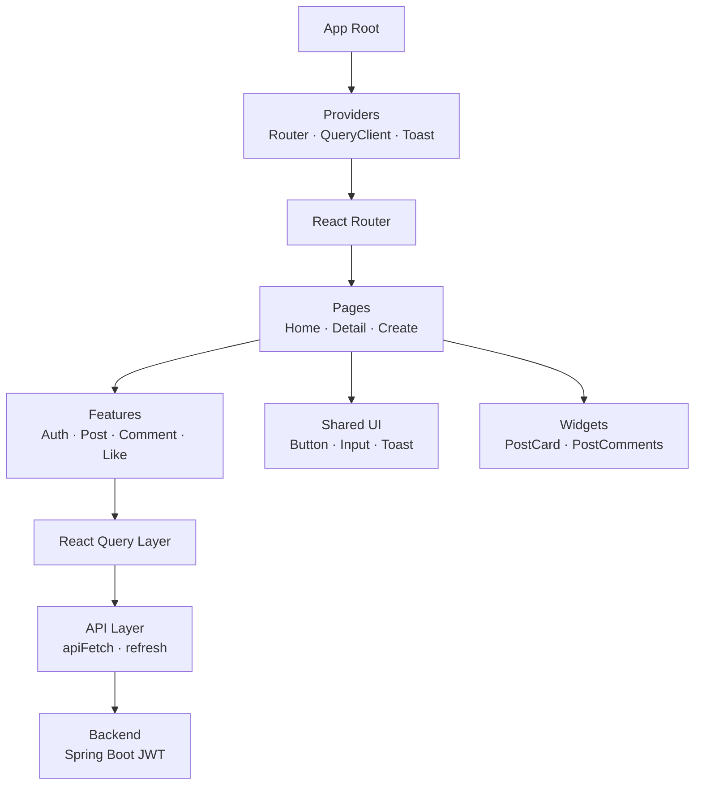

#  🔖 mogi_logi

**React 19 + Vite 기반에서 Router v7 · React Query · FSD 아키텍처를 전면 적용해 구현한 커뮤니티 SPA입니다.**
홈 피드·게시글·댓글·인증까지 모든 기능을 클라이언트에서 처리하며, UI/로직 분리와 디자인 패턴(Container–Presenter, Compound Component 등)을 도입했습니다.


---

# 1. Project Overview

이 프로젝트는 기존 Vanilla SPA + Custom VDOM으로 만든 커뮤니티 서비스를
**React 19 환경으로 완전 마이그레이션**하였습니다.

* **React Router** v7로 라우팅 구조 개선
* **React Query(TanStack Query)로** 데이터 관리 전면 리팩토링
* VDOM에서 배운 **렌더링/상태 관리** 인사이트를 React로 이식
* **FSD(Feature-Sliced Design)** 기반으로 도메인·UI 모듈 구조화
* UI/로직 분리(디자인 패턴 도입)
* 토큰 기반 인증과 세션 기반 글로벌 상태 구축

**React SPA 아키텍처의 전체 흐름을 설계·구현한 프로젝트**입니다.

---

# 2. Tech Stack

## 🔶 언어 & 런타임

* **React 19 (useEffect-free 아키텍처 최소 활용)**
* **Vite + rolldown 번들러**
* sessionStorage 기반 인증 토큰
* Fetch API + Refresh Token 재발급 로직

## 🔶 주요 라이브러리

* **React Router v7 (Data Router 기반)**
* **TanStack Query (useInfiniteQuery 포함)**

## 🔶 스타일링

* **디자인 토큰 기반 스타일 구조**

    * `/src/shared/styles/tokens/*`
    * 색상, 간격, 폰트, 레이아웃 단위 통합 관리
* 컴포넌트 단위 CSS (entities/widgets/features/ui에서 관리)

## 🔶 아키텍처 패턴


### ✨ **디자인 패턴 모음**

| 패턴                          | 사용 목적                  | 적용 예                                  |
| --------------------------- |------------------------|---------------------------------------|
| **Base Abstract Component** | 공통 UI 기본형 추상화          | BaseButton, PostHeaderBase            |
| **Compound Component 패턴**   | 버튼 그룹·모달 등 UI 구성       | ActionGroup, Modal                    |
| **Custom Hook 패턴**          | API/로직 재사용, 비즈니스 로직 분리 | usePostDelete, useHomeInfiniteQueue 등 |
| **Container–Presenter 패턴**  | UI와 로직 분리, FSD와 결합     | PostHeader / PostHeaderBase 구조   등    |

---
## 2-1. React Version Architecture


---
# 3. 아키텍처 설명 (Architecture)

React 마이그레이션 버전에서 핵심으로 구축한 시스템 구조입니다.

---

## 3-1. Provider 계층(App Root)

```
<AppRoot>
  <RouterProvider>
    <QueryClientProvider>
      <ToastProvider>
        <App />
      </ToastProvider>
    </QueryClientProvider>
  </RouterProvider>
</AppRoot>
```

* Router → Query → Toast 순으로 감싸서
  **라우팅 → 데이터 → UI 피드백**의 일관된 파이프라인을 구성했습니다.

* ProtectedRoute 컴포넌트에서
  sessionStorage 토큰 없으면 자동으로 `/login` 이동.

---

## 3-2. API Layer 설계

### 공통 fetch wrapper — `apiFetch()`

* 공통 JSON Fetch + Error handling
* **401 발생 → Refresh → 재요청 자동 처리**
* 실패 시 세션 초기화 및 로그인 페이지 이동

### React Query Hook Wrapper

* `useApiQuery`, `useApiMutation`
* DTO 변환, 에러 토스트 출력, 캐싱·invalidate 통합 처리
* feature 단위로 API 로직을 캡슐화하여 UI와 분리

---

## 3-3. 홈 피드: Cursor 기반 무한 스크롤

**useHomeInfiniteQueue()**

* React Query의 **useInfiniteQuery**로 커서 기반 페이지네이션 처리
* IntersectionObserver로 마지막 요소 관찰 → 자동 fetchNextPage
* 세션 기반 스크롤 위치/페이지 복원(store)

### 스크롤 복원 흐름

1. 스크롤 이벤트 발생 → sessionStorage 저장
2. 뒤로가기·새로고침 시

    * 저장된 scrollY / pageIndex 로 초기 화면 복원
3. React Query의 캐시 데이터를 우선 사용해 빠르게 그려짐

---

## 3-4. 게시글 상세 화면(Post Detail)

### 기능 분리

* 본문(Content)
* 메타 정보(PostHeader)
* 액션 그룹(ActionGroup)
* 댓글(CommentSection)
* 좋아요/조회수 UI

### 좋아요 토글

* useLikeCreat / useLikeDelete mutation
* 게시글 상세 + 홈 목록 쿼리 invalidate
* UI는 Presenter 컴포넌트가 담당

---

## 3-5. 글 생성/수정(PostCreate)

* Page 내부에서 제목/본문 유효성 검사
* usePostCreat / usePostUpdate 통해

    * 생성/수정 분기
    * 성공 시 Toast 출력
    * 쿼리 invalidate 후 페이지 이동

---

## 3-6. 인증(Login/Signup)

* useInput 훅으로 입력값·에러 상태 관리
* useLogin/useSignup에서
  sessionStorage에 토큰 저장
* Router에서 보호된 페이지 접근 시 자동 차단

---
## **3-7. Barrel Pattern을 통한 도메인 캡슐화 (index.js)**

React + FSD 구조를 적용하며, 각 도메인 폴더(`entities`, `features`, `widgets`)는 `index.js`를 사용해 폴더 전체를 **하나의 Public API처럼 노출**하도록 설계했습니다.


- **import 경로 단축 및 일관성 유지**
- **도메인 내부 파일 구조 감추기(캡슐화)**
- **폴더 구조 변경 시 영향 최소화**
- **도메인 단위로 기능을 바라볼 수 있어 유지보수 용이**


```jsx
import { PostHeaderBase, PostCard } from "@/entities/post";
import { usePostDelete } from "@/features/post/delete";
import { ActionGroupContainer } from "@/widgets/actionGroup";

```


---


# 4. FSD 기반 폴더 구조

```
src/
├─ app/              # 엔트리, providers, 라우터 선언
├─ pages/            # 실제 페이지 컴포넌트(Login/Home/PostDetail...)
├─ widgets/          # UI 단위: Header, Footer, PostList...
├─ features/         # 기능 단위: post/like/comment/delete...
├─ entities/         # 도메인 UI 컴포넌트(post/card, comment/card...)
├─ shared/           # 디자인 토큰, apiFetch, hooks, utils, constants
└─ public/
```

FSD의 핵심인
**“도메인(entities) → 기능(features) → 화면(pages)”**
흐름이 자연스럽게 구성되도록 하였고, UI/로직이 단계적으로 분리되어 유지보수가 쉬운 구조를 이루도록 하였습니다.

### 폴더 구조
<details> <summary> 📄 폴더 구조 자세히 보기/숨기기</summary> <div markdown="1">

```
src
├─ main.jsx
├─ App.css
├─ index.css
│
├─ app
│  ├─ App.jsx
│  ├─ AppRoot.jsx
│  ├─ providers
│  │  ├─ index.js
│  │  ├─ with-query-client.jsx
│  │  ├─ with-router.jsx
│  │  └─ with-toast.jsx
│  └─ router
│     ├─ router.jsx
│     ├─ ProtectedRoute.jsx
│     └─ routes.js
│
├─ features
│  ├─ home
│  │  ├─ index.js
│  │  └─ model
│  │        ├─ useHome.js
│  │        └─ useHomeInfiniteQueue.js
│  │
│  ├─ like
│  │  ├─ index.js
│  │  ├─ create
│  │  │     ├─ index.js
│  │  │     └─ model/useLikeCreat.js
│  │  └─ delete
│  │        ├─ index.js
│  │        └─ model/useLikeDelete.js
│  │
│  ├─ post
│  │  ├─ index.js
│  │  ├─ create
│  │  │     ├─ ui
│  │  │     │     ├─ PostCreateButton.jsx
│  │  │     │     ├─ PostCreateTitleInput.jsx
│  │  │     │     ├─ PostCreateContentInput.jsx
│  │  │     │     └─ PostNavIconButton.jsx
│  │  │     ├─ model
│  │  │     │     ├─ usePostCreat.js
│  │  │     │     └─ PostCreatDto.js
│  │  │     ├─ lib/validater.js
│  │  │     └─ style/postCreate.css
│  │  │
│  │  ├─ update
│  │  │     └─ model
│  │  │           ├─ usePostUpdate.js
│  │  │           └─ PostUpdateDto.js
│  │  │
│  │  ├─ delete
│  │  │     └─ model/usePostDelete.jsx
│  │  └─ detail
│  │        └─ model/usePostDetail.js
│  │
│  ├─ auth
│  │  ├─ ui
│  │  │     ├─ LoginButton.jsx
│  │  │     └─ SignupButton.jsx
│  │  ├─ model
│  │  │     ├─ useLogin.js
│  │  │     ├─ useSignup.js
│  │  │     └─ auth.dto.js
│  │  └─ lib/validator.js
│  │
│  ├─ comment
│  │  ├─ index.js
│  │  ├─ create
│  │  │     ├─ ui
│  │  │     │     ├─ CommentCreatForm.jsx
│  │  │     │     └─ CommentCreateButton.jsx
│  │  │     └─ model
│  │  │           ├─ useCommentCreat.js
│  │  │           ├─ CommentCreatDto.js
│  │  │           └─ CommentCreatProps.jsx
│  │  │
│  │  ├─ read
│  │  │     └─ model/useCommentRead.js
│  │  │
│  │  ├─ update
│  │  │     ├─ ui/CommentUpdateButton.jsx
│  │  │     └─ model
│  │  │           ├─ useCommentUpdate.js
│  │  │           └─ CommentUpdateDto.js
│  │  │
│  │  └─ delete
│  │        └─ model/useCommentDelete.js
│  │
│  ├─ actionGroup
│  │  └─ ui
│  │        ├─ ActionGroupContainer.jsx
│  │        ├─ ActionGroup.jsx
│  │        └─ ActionGroupButton.jsx
│  │        └─ style/actionGroup.css
│  │
│  ├─ modal
│  │  └─ ui/ConfirmModal.jsx
│  │        └─ style/confirmModal.css
│  │
│  └─ readme.md
│
├─ shared
│  ├─ index.js
│  ├─ ui
│  │  ├─ button
│  │  │     ├─ BaseButton.jsx
│  │  │     ├─ PrimaryButton.jsx
│  │  │     ├─ SecondaryButton.jsx
│  │  │     ├─ IconCircleButton.jsx
│  │  │     └─ button.css
│  │  │
│  │  ├─ input-field
│  │  │     ├─ InputField.jsx
│  │  │     └─ InputField.css
│  │  │
│  │  ├─ icons
│  │  │     ├─ Icon.jsx
│  │  │     ├─ map.jsx
│  │  │     ├─ LikeIcon.jsx
│  │  │     ├─ assets/*.svg
│  │  │     └─ icon.css
│  │  │
│  │  ├─ logo
│  │  │     ├─ Logo.jsx
│  │  │     ├─ FooterLogo.jsx
│  │  │     └─ assets/{logo.svg, footer-logo.svg}
│  │  │
│  │  ├─ textarea/AutoResizeTextarea.jsx
│  │  └─ toast
│  │        ├─ Toast.jsx
│  │        ├─ ToastContext.jsx
│  │        ├─ useToast.jsx
│  │        └─ toast.css
│  │
│  ├─ utils/timestamp.js
│  ├─ styles
│  │     ├─ global.css
│  │     └─ tokens/{color.css, spacing.css, typography.css}
│  │
│  ├─ model/useScrollStore.js
│  ├─ lib
│  │     ├─ useInput.jsx
│  │     ├─ ContentType.js
│  │     ├─ hooks/postMutation.js
│  │     └─ hooks/commentMutation.js
│  └─ api
│        ├─ constants/endpoint.js
│        ├─ hooks/useApi.js
│        ├─ hooks/useApiQuery.js
│        ├─ hooks/useApiMutation.js
│        └─ base
│              ├─ apiFetch.js
│              └─ refreshToken.js
│
├─ pages
│  ├─ index.js
│  ├─ home/ui/HomeFeed.page.jsx
│  ├─ post/detail/ui/PostDetail.page.jsx
│  ├─ post/create/ui/PostCreate.page.jsx
│  ├─ auth
│  │     ├─ login/ui/LoginPage.jsx
│  │     └─ signup/ui/SignupPage.jsx
│  │        └─ style/auth.css
│  └─ test/test.jsx
│
└─ widgets
   ├─ index.js
   ├─ layout
   │     ├─ AuthLayout.jsx
   │     └─ MainLayout.jsx
   │
   ├─ ui/Header
   │     ├─ Header.jsx
   │     └─ Header.css
   │
   ├─ ui/Footer
   │     ├─ Footer.jsx
   │     └─ Footer.css
   │
   ├─ ScrollProgressBar/ui
   │     └─ ScrollProgressBar.jsx
   │           └─ ScrollProgressBar.css
   │
   ├─ post-header/ui/PostHeader.jsx
   └─ post-comments/ui/PostComments.jsx
         └─ postComment.css
│
└─ entities
   ├─ post
   │     ├─ ui
   │     │     ├─ PostCard.jsx
   │     │     ├─ PostCountGroup.jsx
   │     │     ├─ PostContent.jsx
   │     │     └─ PostHeaderBase.jsx
   │     ├─ model
   │     │     ├─ PostCardProps.jsx
   │     │     ├─ PostContentProps.jsx
   │     │     ├─ PostCountProps.jsx
   │     │     └─ PostHeaderProps.jsx
   │     └─ style/post.css
   │
   └─ comment
         ├─ ui/CommentCard.jsx
         ├─ model/CommentCardProps.jsx
         └─ style/comment.css

```


</div> </details>


---


# 5. UI/UX 설계 포인트

### 디자인 토큰 기반 스타일 통일

* 색상 / spacing / typography / border-radius 등
* 글로벌 토큰으로 UI 일관성 유지
* 컴포넌트별 스타일은 최소한의 별도 CSS만 사용

### Presenter 기반 UI 구성

* PostHeaderBase처럼 UI를 순수하게 유지
* 로직은 Container에서 처리
* 재사용성과 확장성이 크게 증가

### ActionGroup, Modal 등 Compound Component 패턴 적용

* 메뉴/옵션 기능을 유연하게 조합 가능
* 상태 관리 로직은 Custom Hook으로 분리

---

# 6. 주요 기능 (Features)

* **게시글 CRUD**
* **커서 기반 무한스크롤**
* **댓글 CRUD**
* **좋아요 토글 시스템**
* **토큰 기반 인증(Login/Signup)**
* **ProtectedRoute 기반 접근 제어**
* **Toast 기반 피드백**
* **UI/로직 분리 (Container–Presenter 패턴)**

---

# 7. TroubleShooting

- React Query 도입 후 데이터 최신화가 안되던 문제 → 캐시 invalidation 처리

- IntersectionObserver + Infinite Query 병행 시 중복 호출 문제

- 무한 스크롤 + 페이지 복원 간 스크롤 튐 방지


---

# 🎉 Thanks for reading!

> VDOM version의 소개 페이지로 이동하기
>
> **[👉 VDOM Version README](../../vdom-version/vdom-version-readme.md)**

