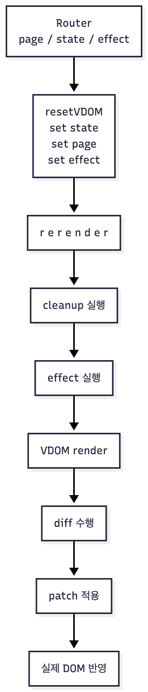
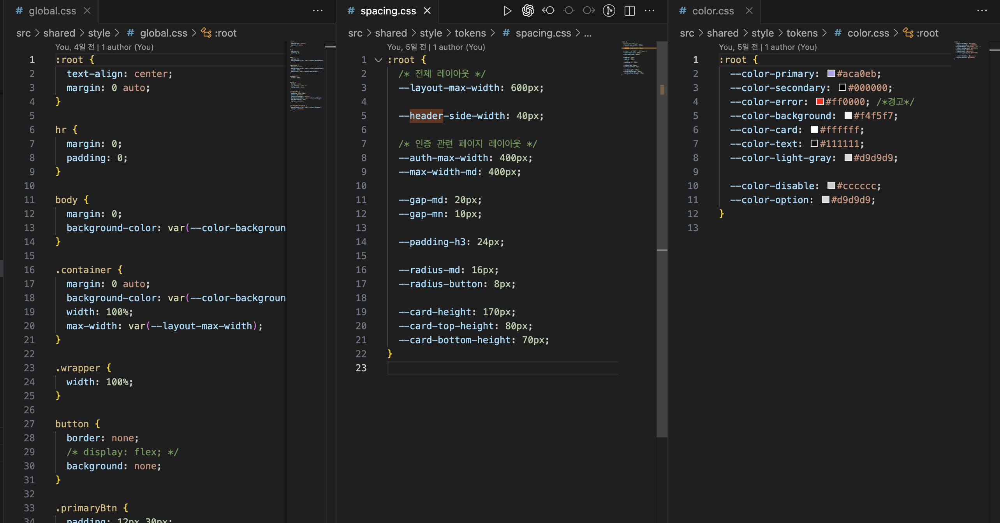

# 📘 ONE_LINE

**Vanilla JavaScript로 직접 구현한 SPA + Custom VDOM + Global State + Effect System 기반 커뮤니티 플랫폼**

간단한 글을 메모하듯 작성하고 공유하는 **미니 커뮤니티 플랫폼**입니다.

해당 프로젝트의 핵심은 React 없이 **Vanilla JS만으로 SPA/VDOM/상태/Effect 시스템을 직접 구현했습니다.**

### 프로젝트 데모 영상

[](https://www.youtube.com/watch?v=DLSYWXPwkE8)


---

# 1.  Project Overview

바닐라 JavaScript 기반으로,

- **Virtual DOM 아키텍처 설계**
- **SPA Router + 전역 State 관리 + Effect 시스템 직접 구현**
- **컴포넌트 기반 구조(FSD)를 Vanilla JS에 이식**

**React 없이 React와 유사한 렌더링 사이클**을 구현한 개인 프로젝트입니다.

> 어떤 프레임워크에도 의존하지 않고, 프론트엔드 렌더링 구조 전체를 이해하고 직접 설계·구현해본다는 목표로 제작하였습니다.
>

### Intro

---

# 2. Tech Stack

### **🔶 언어 & 런타임**

- 순수 **ES Modules 기반 Vanilla JavaScript**
- 브라우저 **sessionStorage**, **Fetch API** 사용
- Node.js & NPM은 **개발 환경·툴링용**으로만 사용

---

### **🔶 스타일링 (Styling)**

- 전역 디자인 토큰 기반 **global.css** (색상, 간격, 타이포 등 공용 변수)
- 페이지/위젯별 스타일은
    - 공통 클래스 사용
    - 필요 시 **VDOM inline style**로 주입

---

### 🔶 아키텍처 핵심 유틸 (Core Architecture)

- **Custom Virtual DOM + Diff Engine** (`src/shared/DOMutil/*`)
- **전역 상태 + Effect 트래킹 시스템** (`src/shared/state/*`)
- **Hash 기반 SPA Router** (`src/shared/router/Router.js`)
- **외부 프레임워크 없이 구성한 렌더 사이클**

---

### **🔶 구조 패턴 (Architecture Pattern)**

- **Feature-Sliced Design(FSD)** 구조 적용

    ```
    app / pages / widgets / features / entities / shared
    
    ```

- 각 레이어는 VDOM + effect + state 조합을 통해 컴포넌트화

---

# 3. 시스템 아키텍처 (Core Architecture)

이 프로젝트는 Vanilla JS 환경에서 **React 수준의 렌더링 구조를 직접 구현**한 SPA입니다.

렌더 사이클, 상태, Diff 엔진, Effect 시스템, Router가 모두 독립적이고 일관된 방식으로 연동됩니다.

---

## 3-1. 렌더 사이클 (Render Cycle)

렌더링의 순서입니다.

> state → cleanup → effect → VDOM render → diff → patch
>

### 흐름 요약

- `setState()` → 전역 상태 병합 → 즉시 `rerender()`
- `rerender()`
    1. 기존 effect cleanup 실행
    2. 현재 페이지의 VDOM 생성
    3. effect 배열 재실행
- 최초 렌더: `render()`가 실제 DOM 생성
- 이후 렌더: diff 알고리즘으로 필요한 부분만 patch

DOM 직접 조작은 diff 단계에서만 이루어집니다.

---

## 3-2. VDOM 엔진 구조 (Virtual DOM Engine)

### VNode 생성

- `h(type, props, ...children)`→ 가상 노드(VNode)를 생성합니다.

### 렌더러 (render)

- 문자열/요소 노드를 구분해 실제 DOM 변환
- props 전부 DOM 속성에 매핑

### diff 패칭 알고리즘

`updateElement()`는

1. 타입/텍스트 비교 후 필요 시 전체 교체
2. 동일 노드면 `updateProps` 처리
3. 자식 노드는 재귀 diff

→ 최소 patch 전략 유지

---

## 3-3. Effect 시스템

UI는 순수하고, 모든 DOM 이벤트는 Effect 계층에서만 관리합니다.

### ✔ UI 컴포넌트는 순수 함수

- UI 컴포넌트는 오직 **VNode 구조만 반환**합니다.
- `onClick`, `onInput` 등 핸들러를 **props로 전달하지 않습니다.**

### ✔ 모든 이벤트는 Effect 계층에서 관리

- 클릭/입력 등 모든 이벤트 바인딩은 전용 Effect 파일에서 처리됩니다.
    - 예: ProfileButtonVDOM은 버튼 DOM만 반환하고, 클릭 이벤트는 ProfileButtonEffect에서 attach합니다.

### ✔ cleanup 기반 이벤트 중복 방지

- rerender() 실행 시 effect 재실행 전에 항상 기존 cleanup이 먼저 호출됩니다.
- 페이지 이동 및 재렌더링에서 이벤트가 중복 등록되지 않습니다.

---

## 3-4. Router 구조 (SPA Routing System)

라우터는 **해시 기반 SPA 구조**를 사용하며, 경로마다 다음 정보를 등록합니다:

```
{
  page: VDOM factory,
  state: initialState,
  effect: effect[]
}
```

### 페이지 전환 시 공통 흐름

```less
		//이전 DOM 트레이스 완전 초기화
    resetVDOM();

		//이전 effect 및 이벤트 핸들러 정리
    //state 등록
    setCurrentState({ ... });
    
    //페이지 등록
    setCurrentPage( PageVDOM);
    
    //effect 등록
    setCurrentEffect([ ... ]);

    rerender();
    return;
```

> resetVDOM → setCurrentState → setCurrentPage → setCurrentEffect → rerender
>

비동기 데이터(게시글 상세/수정)는 effect 내부에서 API 호출 후 state 갱신.

---

## 3-5. FSD 기반 폴더 구조 (Feature-Sliced Design)

기능 단위로 모듈을 분리하는 FSD 구조를 적용했습니다.

```
frontend/
└─ src/
   ├─ app/                      # 엔트리, LayoutVDOM, Router
   ├─ features/                 # 도메인 로직, API, validator, model
   ├─ pages/                    # 실제 화면 (VDOM + state + effect)
   ├─ shared/                   # VDOM 엔진, 상태, 유틸, 스타일
   ├─ widgets/                  # UI 블록(프로필, 댓글, 액션그룹 등)
   └─ public/                   # 브라우저 환경 변수

```

### 컴포넌트 데이터 흐름

- **base-ui → page-ui → handler → api**
- 각 기능은 독립된 흐름을 따라가며 테스트/확장에 수월하게 작성됨
- fetch 하나만 있어도 *handle* 레이어를 유지해 일관성 확보

---

## 3-5. 아키텍처 흐름도



---

# 4. 주요 기능 (Features)

- **게시글 CRUD**: 홈·작성·수정·상세 페이지를 VDOM + state + effect 기반으로 구성하여 전체 게시글 흐름을 SPA 내부에서 처리.
- **댓글 시스템**: 댓글 목록·작성·수정 UI 제공, 액션 그룹을 통한 수정/삭제 모달 지원.
- **좋아요/조회수 UI**: 좋아요 토글, 댓글 수, 조회수 등 게시글 통계를 실시간 반영.
- **인증 기능**: 로그인/회원가입, 토큰 기반 세션 관리, 라우터에서 보호된 경로 접근 제어.
- **프로필 메뉴**: 사용자 정보, 비밀번호 변경, 로그아웃 등의 메뉴 제공.
- **토스트 & 모달 피드백**: 공용 Toast와 액션 모달로 사용자 액션에 즉각적인 시각적 피드백 제공.

---

# 5. UI/UX 설계 포인트

### CSS 토큰화 전략

디자인 토큰을 global.css로 관리하여

- 색상
- 여백
- 타이포그래피


---

# 6. TroubleShooting

**[vanila JS]**

- [[TroubleShooting] DTO와 Props 역할 분리](../TroubleShooting/dto-props-separation.md)
- [[TroubleShooting] ActionGroup 재사용 컴포넌트 설계](../TroubleShooting/actiongroup-reusable-component.md)
- [[TroubleShooting] 로그인 상태 관리와 라우팅 충돌 문제](../TroubleShooting/spa-auth-redirect-issue.md)
- [[TroubleShooting] SPA Header 상태 제어와 Web Component 도입](../TroubleShooting/webcomponent-header-state-control.md)

**[vanila JS - VDOM]**

- [[TroubleShooting] VDOM 환경에서 이벤트 리스너로 발생한 무한 루프](../TroubleShooting/vdom-eventlistener-infinite-loop.md)
- [[TroubleShooting] useState]()

---

## 🎉 Thanks for reading!
